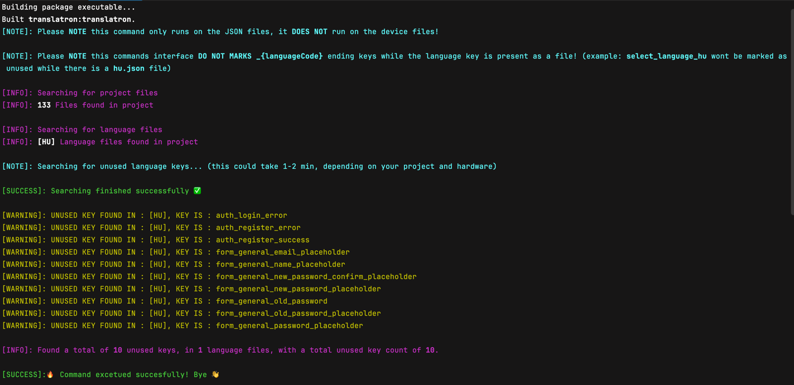
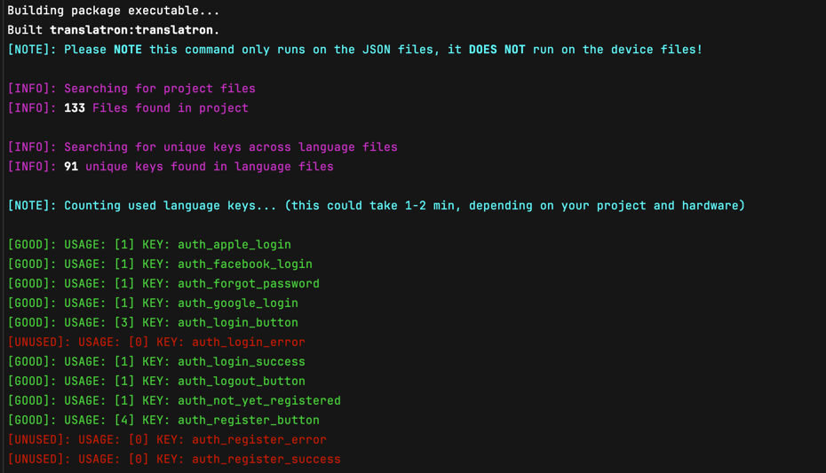
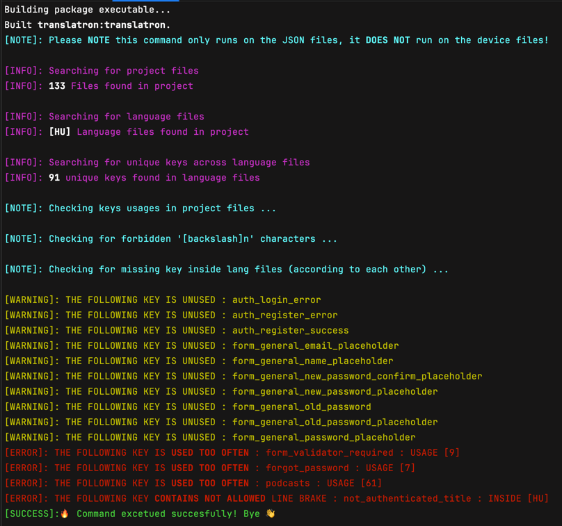

# Welcome to Translatron!


# Installation
Add the following to your `pubspec.yaml` file:
```yaml
dependencies:
  translatron: [latest-version]
```
Import the package into your Dart file:
```dart
import 'package:translatron/translatron.dart';
```

# Description
Translatron package is a translation tool designed for Flutter applications.
It provides a simple and easy-to-use interface for managing translations, either from a custom API or local translations.

The package includes features for loading and saving language files, converting `.json` strings to maps, and handling exceptions.

The package supports multiple languages and custom API headers.
It also provides a way to add a custom delegate to the app and to change the language with a provider.

In addition, the package provides several functions for translation-related tasks, such as translating a string, checking if a language is active, getting the supported locales, and getting or setting the selected language locale.

# Setup & Usage

### Setup
You need to create in your project root folder a `lang/` folder with as many `.json` files as you want in your project.
You also need to name your `.json` files with the language code, for example: `en.json`, `hu.json`, etc.

You must add at least one key-value pair to each `.json` file, for example:
```json
{
    "key_in_the_json_file": "This will be the translated text in your app"
}
```
Otherwise you will receive an error message when you run your application.

Make sure to add this folder to your `pubspec.yaml` file:
```yaml
flutter:
  assets:
    - lang/
```

### Initiation
You must initiate Translatron in your main function before running the app however there are multiple options to initiate.
You can use whatever method you require.

#### Initiation parameters
- `String` hostname: The hostname of your API.
- `String` versionPath: The path to the version endpoint of your API.
- `String` translationsPath: The path to the translations endpoint of your API.
- `bool` hasWebServer: If you want to use the web server or not.
- `List<Locale>` supportedLocales: A list of supported locales.
- `Map<String, String>?` apiHeaders: The headers to be added to the API requests.

##### Default values
```dart
String hostname = "",
String versionPath = "",
String translationsPath = "", 
List<Locale> supportedLocales = const [Locale('hu')],
Map<String, String>? apiHeaders,
bool hasWebServer = false,
bool reLoadAtStart = false,
```

#### Initiation
You can initiate Translatron like in this example without any parameters set up.

```dart
    void main() async {
        await Translatron.init();
    ]);
```

Or you can set each parameter individually like in this example:

```dart
void main() async {
  await Translatron.init(
      hostname: "https://example.com",
      versionPath: "/api/translation/version",
      translationsPath: "/api/translation/translations",
      hasWebServer: true,
      supportedLocales: const [
        Locale('hu'),
        Locale('en'),
      ],
      apiHeaders: const {
        "Authorization": "Bearer $token",
        "Content-Type: application/`.json`"
      });
}
```

### Notes
- If you add a new locale to the `supportedLocales`, you must also add a `.json` file with the same name to the `lang/` folder.
- If you set up the `hasWebServer` parameter to `true`, you must also set up the `hostname`, `versionPath`, and `translationsPath` parameters.
- You should always check the very first logs to see if there are any errors with your setups.


### Add the custom delegate to app
You need to add the custom delegate to your app to make it work. You can do this by adding the following code to your `MaterialApp` widget:
```dart
return MaterialApp.router(
    title: 'DemoApp',
	localizationsDelegates:  const [
		Translatron.delegate,
		GlobalMaterialLocalizations.delegate,
		GlobalWidgetsLocalizations.delegate,
		GlobalCupertinoLocalizations.delegate,
	],
	//To change to your state management
	locale: Provider.of<LocaleProvider>(context,  listen:  true).getlocale, 
	supportedLocales:  Translatron.getSupportedLocales,
);
```

### Demo provider
You can use or modify the following provider class to manage the language in your app:
```dart
class LocaleProvider with ChangeNotifier {
	Locale? locale = Translatron.getSelectedLanguageLocale;
	
	Locale? get getLocale {
		return locale;
	} 

	void changeLocale(Locale  newLocale) {
		locale = newLocale;
		Translatron.setSelectedLanguageLocale = locale!;
		notifyListeners();
	}
}
```

#### Language change with provider
You can use the following code to change the language in your app using the provider:
```dart
Provider.of<LocaleProvider>(context, listen: false)
    .changeLocale(const Locale('en', 'EN'));
```

### Functions

#### Translation
This function is used to translate a given key from your `.json` file's key into the currently selected language. It takes in a single parameter:
- `String` translation_key: The key of the string to be translated.
```dart
String translation_key = "key_in_the_json_file";
Translatron.of(context)!.translate(translation_key);
```
#### Check if a language is active
This function is used to check if a given language is currently active it will return a bool value. It takes in a single parameter:
- languageCode: The language code of the language to check.
```dart
String languageCode = "en";
Translatron.isLanguageActice(languageCode);
```

#### Get the supported locales
This function is used to get a list of all supported locales.
It returns a `List<Locale>` with all supported locales.
```dart
Translatron.getSupportedLocales;
```

#### Get the selected language locale
This function is used to get the currently selected language locale.
It returns a `Locale` with the currently selected language locale but in some cases it could be nullable.
```dart
Translatron.getSelectedLanguageLocale;
```

#### Set the selected language locale
This function is used to set the currently selected language locale.
It takes in a single parameter:
- `Locale` locale: The locale to set as the currently selected language locale.
```dart
Locale locale = const Locale('en');
Translatron.setSelectedLanguageLocale = locale!;
```

# Command line helper tool

The package also includes a command line tool to help you manage your translations.
You can use the following commands to manage your translations:

### Check for unused translations
This command is runs a check to find any unused translations in your project.
If any unused translations are found, the command will print a list of them to the console and it will also associate the language code .
```bash
application % dart run translatron --unused
```


### Statistics
This will give you a statistics of the translation files in your project.
It will print the number of translations in each language file and the total number of translations in the project.
```bash
dart run translatron --stat
```


### Check
This command is used to check the translation files in your project.
It will print a list of any errors or warnings that are found in the translation files to the console.
```bash
dart run translatron --check
```

